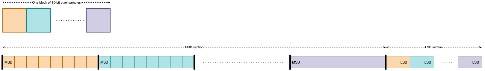
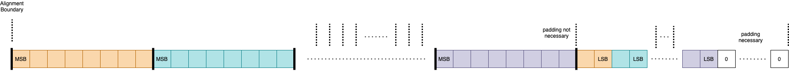

# \[Work In Progress\] VSF Cloud Exchange Format (CEF)

## Scope

This document proposes a default video sample packing format for cloud-to-cloud interfaces. It is intended to provide a good compromise between packing density, complexity of packing/unpacking and support for different bit depths.

## Introduction

ST 2110 10-bit pgroup packing was optimised to support a particular set of use cases, but is not well suited to some cloud-cloud cases, as working in multiples of 8 bits is the norm for software applications. Padding to 16 bits is wasteful, and shifting tightly-packed 10-bits imposes an overhead. Also, some receiving applications may only work with 8 bits.

The approach proposed here is to pack the 8 most significant bits of each of a block of pixels (by default a video line) first (“MSB section”), followed by the remaining (less significant) bits of the block at the end (“LSB section”):

Such an approach is efficient, easy to pack and unpack, and an 8-bit receiver can skip over the remaining bits.

The document is approximately equivalent to a simplified version of a more general proposal to the IETF (see [draft-weaver-pef-00](https://datatracker.ietf.org/doc/draft-weaver-pef)), but constrained to be most useful for the majority of expected use cases. 

## Layout

### Sample sizes/bit depths

By default this proposal applies to 10-bit samples, which are represented as in the example in the Introduction.

Larger bit depths should be supported, with the following two cases of particular importance:

- 12-bit samples are represented in a similar way, i.e. 8-bit MSB section followed by 4-bit LSB section.
- 16-bit samples are not separated into MSB and LSB sections, and are represented as 16-bit low-endian words.

## Interlace

By default, lines are sent in temporal order.

### Block size

By default, a block corresponds to one video line.

Other block sizes can be used if [signaled accordingly](#signaling).

> TODO: Possible comments on efficiency of larger block sizes and relevance to interlace

> TODO: Diagram to cover interlace and blocksize

### Alignment for memory access

By default the MSB for the first sample in the line is aligned at a boundary that is a suitable power-of-two number of octets, and the LSB section is similarly aligned.

Software may want to specify a particular alignment for the start of a line in order to ensure optimal use of the underlying architecture.  Software may want to request alignment for the same reasons.  This could be for machine register sizes or for memory page layouts or for some finer detail about the memory on a given system.

### Alignment for other reasons
In addition to architecture performance reasons there may be application or user reasons for alignment of lines, blocks, or other pieces.

### Padding
If necessary. MSB and LSB sections are zero-padded, after the data, to the alignment boundary.

For standard video sizes padding of the MSB section is unlikely to be necessary. For example, assuming one 1920-pixel line per block, no padding is required for alignment sizes up to 1024 bits (because 1920 x 8 = 1024 x 15). 

Padding of the LSB section is more likely to be necessary, especially where there are more stringent alignment requirements. In the above example, no padding is required up to 256 bits (because 1920 x 2 = 256 x 15). 

This shows a case where only the LSB section needs padding:

## Planar vs Interleaved

By default channels are sent at separate planes rather than interleaved samples, for example separate planes of:

- Y, Cb and Cr
- R, G and B
- R, G, B and A

> TODO: Add example diagram

This is consistent with the approach of the IETF draft.

Other cases could be sent if [suitably signaled](#signaling):

- Many fully packed formats keep different channel samples of the same pixel together in an order that may not be well defined.  
- Many fully unpacked formats separate the samples of each channel into separate planes.  
- Some uses might use an "intermediate" format; for example chroma samples are interleaved together but luma samples are not.
 
## Parameters

To support different use cases CEF has a number of parameters.

Some of these follow from the above descriptions such as:

- picture sizes
- bit depths
- chroma resolution
- planar/interleaved samples
- block size
- block alignment

Others are still to be defined.

> TODO: determine a more complete list and document more formally, including parameter names, semantics, constraints and defaults.

> TODO: Consider defining profiles / operating points. For example what is suitable for CDI? What are the most common resolutions?

> TODO: look at the relevant information for VSF's J2K ULL and JPEG XS (TR-08 operating points)/.

## Signaling

Parameters can be signaled out-of-band or in-band.

### Out-of-band signaling

Larger changes such as frame size, frame rate, chroma subsampling, bit depth are probably all acceptable for out-of-band signaling.  

> The IETF draft proposes a new MIME Type and a set of required parameters and a few optional ones.  That implies out-of-band signaling.  Is it still flexible enough for the current proposal?

> What is the relevance of AMWA's parameter register? See related activity on JPEG XS.

### In-band signaling

In-band signaling may be more suitable for transient changes such as:

- Notification of data loss such as missing frames, lines or samples.
- Ancillary or side information such as CC/subtitles.

## Support for particular uses

### Chromakey

> TODO: add detail

### Overlays

> TODO: add detail

### Sub-images and bugs/logos

This could be treated as small images, although sending the image size and position in the larger frame is not in the scope of the current proposal.

 ### Previews and thumbnails

Many applications involve rendering of a reduced resolution or quality rendition of a video stream; for example to display in a small window or thumbnail on a browser-based monitoring interface. In such cases processing resources can be reduced by only reading the 8-bit MSBs.
